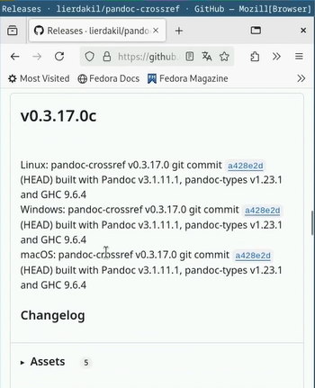
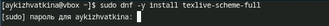

---
## Front matter
title: "Oтчёт по лабораторной работе 2"
subtitle: "Операционные системы"
author: "Кижваткина Анна Юрьевна"

## Generic otions
lang: ru-RU
toc-title: "Содержание"

## Bibliography
bibliography: bib/cite.bib
csl: pandoc/csl/gost-r-7-0-5-2008-numeric.csl

## Pdf output format
toc: true # Table of contents
toc-depth: 2
lof: true # List of figures
lot: true # List of tables
fontsize: 12pt
linestretch: 1.5
papersize: a4
documentclass: scrreprt
## I18n polyglossia
polyglossia-lang:
  name: russian
  options:
	 - spelling=modern
	 - babelshorthands=true
polyglossia-otherlangs:
  name: english
## I18n babel
babel-lang: russian
babel-otherlangs: english
## Fonts
mainfont: IBM Plex Serif
romanfont: IBM Plex Serif
sansfont: IBM Plex Sans
monofont: IBM Plex Mono
mathfont: STIX Two Math
mainfontoptions: Ligatures=Common,Ligatures=TeX,Scale=0.94
romanfontoptions: Ligatures=Common,Ligatures=TeX,Scale=0.94
sansfontoptions: Ligatures=Common,Ligatures=TeX,Scale=MatchLowercase,Scale=0.94
monofontoptions: Scale=MatchLowercase,Scale=0.94,FakeStretch=0.9
mathfontoptions:
## Biblatex
biblatex: true
biblio-style: "gost-numeric"
biblatexoptions:
	  - parentracker=true
	  - backend=biber
	  - hyperref=auto
	  - language=auto
	  - autolang=other*
	  - citestyle=gost-numeric
## Pandoc-crossref LaTeX customization
figureTitle: "Рис."
tableTitle: "Таблица"
listingTitle: "Листинг"
lofTitle: "Список иллюстраций"
lotTitle: "Список таблиц"
lolTitle: "Листинги"
## Misc options
indent: true
header-includes:
  - \usepackage{indentfirst}
  - \usepackage{float} # keep figures where there are in the text
  - \floatplacement{figure}{H} # keep figures where there are in the text
---

# Цель работы

Целью данной работы является приобретение практических навыков установки операционной системы на виртуальную машину, настройки минимально необходимых для дальнейшей работы сервисов.

# Выполнение лабораторной работы

Устанавливаем VirtualBox. Создаем виртуальную машину с операционной системой Linux Fedora. (рис. [-@fig:001])

{#fig:001 width=70%}

Заходим в ОС под заданной при установке учетной записью. Нажимаем комбинацию Win+Enter для запуска терминала. (рис. [-@fig:002])

{#fig:002 width=70%}

Переключаемся на роль супер-пользователя. (рис. [-@fig:003])

{#fig:003 width=70%}

Устанавливаем средства разработки. (рис. [-@fig:004])

{#fig:004 width=70%}

Обновляем все пакеты. (рис. [-@fig:005])

{#fig:005 width=70%}

Скачиваем программы для удобства работы в консоли. (рис. [-@fig:006] рис. [-@fig:007])

{#fig:006 width=70%}

{#fig:007 width=70%}

При необходимости можно использовать автоматическое обновление. Устанавливаем программное обеспечение. (рис. [-@fig:008])

{#fig:008 width=70%}

Запускаем таймер. (рис. [-@fig:009])

{#fig:009 width=70%}

Так как в данном курсе мы не будем работать с системой безопасности SELinux отключаем её. Для этого в файле /etc/selinux/config заменим значение SELINUX=enforcing на SELINUX=permissive. После этого перезапускаем виртуальную машину. (рис. [-@fig:010])

{#fig:010 width=70%}

Запускаем терминальный мультиплексор tmux. (рис. [-@fig:011])

{#fig:011 width=70%}

Создаем конфигурационный файл ~/.config/sway/config.d/95-system-keyboard-config.conf. (рис. [-@fig:012])

{#fig:012 width=70%}

Редактируем созданный файл. (рис. [-@fig:013])

{#fig:013 width=70%}

Переключаемся на роль супер-пользователя. (рис. [-@fig:014])

{#fig:014 width=70%}

Отредактируем конфигурационный файл /etc/X11/xorg.conf.d/00-keyboard.conf с помощью файлого менеджера mc и его втроенного редактора. (рис. [-@fig:015])

{#fig:015 width=70%}

Перезапускаем виртуальную машину. (рис. [-@fig:016])

{#fig:016 width=70%}

Запускаем терминальный мультиплексор tmux. (рис. [-@fig:017])

{#fig:017 width=70%}

Переключаемся на роль супер-пользователя. (рис. [-@fig:018])

{#fig:018 width=70%}

Создаем пользователя. (рис. [-@fig:019])

{#fig:019 width=70%}

Задаем пароль для пользователя. (рис. [-@fig:020])

{#fig:020 width=70%}

Установите имя хоста. Проверяем выполнение команды. (рис. [-@fig:021])

{#fig:021 width=70%}

Устанавливаем pandoc с помощью менеджера пакетов. (рис. [-@fig:022])

{#fig:022 width=70%}

Приступаем к установке pandoc-crossref. Скачиваем нужную нам версию с сайта https://github.com/lierdakil/pandoc-crossref. (рис. [-@fig:023])

{#fig:023 width=70%}

Распаковываем архив и переносим файлы в каталог /usr/local/bin. (рис. [-@fig:024] рис. [-@fig:025])

{#fig:024 width=70%}

{#fig:025 width=70%}

Устанавливаем дистрибутив TeXlive. (рис. [-@fig:026])

{#fig:026 width=70%}

# Выводы

Я приобрела практические навыки установки операционной системы на виртуальную машину, научилась делать настройку минимально необходимых для дальнейшей работы сервисов.

