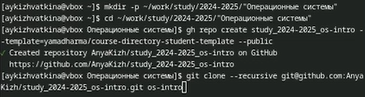

---
## Front matter
title: "Oтчёт по лабораторной работе 2"
subtitle: "Операционные системы"
author: "Кижваткина Анна Юрьевна"

## Generic otions
lang: ru-RU
toc-title: "Содержание"

## Bibliography
bibliography: bib/cite.bib
csl: pandoc/csl/gost-r-7-0-5-2008-numeric.csl

## Pdf output format
toc: true # Table of contents
toc-depth: 2
lof: true # List of figures
lot: true # List of tables
fontsize: 12pt
linestretch: 1.5
papersize: a4
documentclass: scrreprt
## I18n polyglossia
polyglossia-lang:
  name: russian
  options:
	- spelling=modern
	- babelshorthands=true
polyglossia-otherlangs:
  name: english
## I18n babel
babel-lang: russian
babel-otherlangs: english
## Fonts
mainfont: IBM Plex Serif
romanfont: IBM Plex Serif
sansfont: IBM Plex Sans
monofont: IBM Plex Mono
mathfont: STIX Two Math
mainfontoptions: Ligatures=Common,Ligatures=TeX,Scale=0.94
romanfontoptions: Ligatures=Common,Ligatures=TeX,Scale=0.94
sansfontoptions: Ligatures=Common,Ligatures=TeX,Scale=MatchLowercase,Scale=0.94
monofontoptions: Scale=MatchLowercase,Scale=0.94,FakeStretch=0.9
mathfontoptions:
## Biblatex
biblatex: true
biblio-style: "gost-numeric"
biblatexoptions:
  - parentracker=true
  - backend=biber
  - hyperref=auto
  - language=auto
  - autolang=other*
  - citestyle=gost-numeric
## Pandoc-crossref LaTeX customization
figureTitle: "Рис."
tableTitle: "Таблица"
listingTitle: "Листинг"
lofTitle: "Список иллюстраций"
lotTitle: "Список таблиц"
lolTitle: "Листинги"
## Misc options
indent: true
header-includes:
  - \usepackage{indentfirst}
  - \usepackage{float} # keep figures where there are in the text
  - \floatplacement{figure}{H} # keep figures where there are in the text
---

# Цель работы

Целью данной лабораторной работы является изучение идеологии и применение средств контроля версий, и освоение умений по работе с git.

# Выполнение лабораторной работы

Установим git. (рис. [-@fig:001])

{#fig:001 width=70%}

Установка gh. (рис. [-@fig:002])

{#fig:002 width=70%}

Зададим имя и email владельца репозитория. (рис. [-@fig:003])

{#fig:003 width=70%}

Настроим utf-8 в выводе сообщений git. (рис. [-@fig:004])

{#fig:004 width=70%}

Зададим имя начальной ветки. (рис. [-@fig:005])

{#fig:005 width=70%}

Параметр autocrlf. (рис. [-@fig:006])

{#fig:006 width=70%}

Параметр safecrlf. (рис. [-@fig:007])

{#fig:007 width=70%}

Создаем ключ ssh по алгоритму rsa с ключом размером 4096 бит. (рис. [-@fig:008])

{#fig:008 width=70%}

Создаем ключ ssh по алгоритму ed25519. (рис. [-@fig:009])

{#fig:009 width=70%}

Генерируем ключ. Выбираем соответствующие опции и вносим личную информацию, которая сохранится в ключе. (рис. [-@fig:012] рис. [-@fig:011])

{#fig:010 width=70%}

{#fig:011 width=70%}

Так как в прошлом семестре мы работали с GitHub учетную запись создавать не надо.

Выводим список ключей и копируем отпечаток приватного ключа. (рис. [-@fig:012])

{#fig:012 width=70%}

Скопируем наш сгенерированный PGP ключ в буфер обмена. (рис. [-@fig:013])

{#fig:013 width=70%}

Переходим в настройки GitHub, нажимаем кнопку New GPG key и вставляем в поле сохраненный ключ. (рис. [-@fig:014])

{#fig:014 width=70%}

Используя введенный email, укажем Git применять его при подписи коммитов. (рис. [-@fig:015] рис. [-@fig:016])

{#fig:015 width=70%}

{#fig:016 width=70%}

Перейдем к настройке gh. Для начала надо авторизоваться. Отвечаем на наводящие вопросы. (рис. [-@fig:017])

{#fig:017 width=70%}

Создаем репозиторий. (рис. [-@fig:018])

{#fig:018 width=70%}

Переходим в каталог курса. (рис. [-@fig:019])

{#fig:019 width=70%}

Удаляем лишние файлы. (рис. [-@fig:020])

{#fig:020 width=70%}

Создаем необходимые каталоги. (рис. [-@fig:021])

{#fig:021 width=70%}

Отправляем файлы на сервер. (рис. [-@fig:022] рис. [-@fig:0023])

{#fig:022 width=70%}

{#fig:023 width=70%}

# Выводы

Мы изучили идеологию и применение средств контроля версий. Освоили умения по работе с git.
