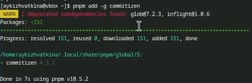
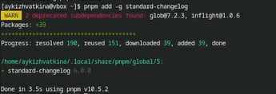
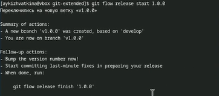

---
## Front matter
title: "Oтчёт по лабораторной работе 4"
subtitle: "Операционные системы"
author: "Кижваткина Анна Юрьевна"

## Generic otions
lang: ru-RU
toc-title: "Содержание"

## Bibliography
bibliography: bib/cite.bib
csl: pandoc/csl/gost-r-7-0-5-2008-numeric.csl

## Pdf output format
toc: true # Table of contents
toc-depth: 2
lof: true # List of figures
lot: true # List of tables
fontsize: 12pt
linestretch: 1.5
papersize: a4
documentclass: scrreprt
## I18n polyglossia
polyglossia-lang:
  name: russian
  options:
	- spelling=modern
	- babelshorthands=true
polyglossia-otherlangs:
  name: english
## I18n babel
babel-lang: russian
babel-otherlangs: english
## Fonts
mainfont: IBM Plex Serif
romanfont: IBM Plex Serif
sansfont: IBM Plex Sans
monofont: IBM Plex Mono
mathfont: STIX Two Math
mainfontoptions: Ligatures=Common,Ligatures=TeX,Scale=0.94
romanfontoptions: Ligatures=Common,Ligatures=TeX,Scale=0.94
sansfontoptions: Ligatures=Common,Ligatures=TeX,Scale=MatchLowercase,Scale=0.94
monofontoptions: Scale=MatchLowercase,Scale=0.94,FakeStretch=0.9
mathfontoptions:
## Biblatex
biblatex: true
biblio-style: "gost-numeric"
biblatexoptions:
  - parentracker=true
  - backend=biber
  - hyperref=auto
  - language=auto
  - autolang=other*
  - citestyle=gost-numeric
## Pandoc-crossref LaTeX customization
figureTitle: "Рис."
tableTitle: "Таблица"
listingTitle: "Листинг"
lofTitle: "Список иллюстраций"
lotTitle: "Список таблиц"
lolTitle: "Листинги"
## Misc options
indent: true
header-includes:
  - \usepackage{indentfirst}
  - \usepackage{float} # keep figures where there are in the text
  - \floatplacement{figure}{H} # keep figures where there are in the text
---

# Цель работы

Получение практических навыков правильной работы с репозиторием git.

# Выполнение лабораторной работы

Описываются проведённые действия, в качестве иллюстрации даётся ссылка на иллюстрацию (рис. [-@fig:001]).

Заходим в виртуальную машину и открываем консоль с помощью комбинации Win+Enter. (рис. [-@fig:001])

{#fig:001 width=70%}

Устанавливаем git-flow. (рис. [-@fig:002])

{#fig:002 width=70%}

Устанавливаем Node.js. (рис. [-@fig:003] рис. [-@fig:004])

{#fig:003 width=70%}

{#fig:004 width=70%}

Для работы с Node.js добавим каталог с исполняемыми файлами, устанавливаем yarn, в переменную path. (рис. [-@fig:005] рис. [-@fig:006])

{#fig:005 width=70%}

{#fig:006 width=70%}

Устанавливаем программу для помощи в форматировании коммитов. (рис. [-@fig:007])

{#fig:007 width=70%}

Устанавливаем Standard-changelog для помощи в создании логов. (рис. [-@fig:008])

{#fig:008 width=70%}

Создаем репозиторий на GitHub. Называем его git-extended. (рис. [-@fig:009])

{#fig:009 width=70%}

Делаем первый коммит и выкладываем на github. (рис. [-@fig:010])

{#fig:010 width=70%}

Делаем конфигурацию для пакетов Node.js. Необходимо заполнить несколько параметров пакета. (рис. [-@fig:011])

{#fig:011 width=70%}

Сконфигурируем формат коммитов. Для этого добавим в файл package.json команду для формирования 
коммитов. (рис. [-@fig:012])

{#fig:012 width=70%}

Добавим новые файлы. (рис. [-@fig:013])

{#fig:013 width=70%}

Выполняем коммит. (рис. [-@fig:014])

{#fig:014 width=70%}

Отправляем на github. (рис. [-@fig:015])

{#fig:015 width=70%}

Переходим к конфигурации git-flow. Инициализируем git-flow. (рис. [-@fig:016])

{#fig:016 width=70%}

Префикс для ярлыков установим в v.

Проверяем, что мы на ветке develop. (рис. [-@fig:017])

{#fig:017 width=70%}

Загружаем весь репозиторий в хранилище. (рис. [-@fig:018])

{#fig:018 width=70%}

Устанавливаем внешнюю ветку как вышестоящую для этой ветки. (рис. [-@fig:019])

{#fig:019 width=70%}

Создадим релиз с версией 1.0.0. (рис. [-@fig:020])

{#fig:020 width=70%}

Создадим журнал изменений. (рис. [-@fig:021])

{#fig:021 width=70%}

Добавим журнал изменений в индекс. (рис. [-@fig:022])

{#fig:022 width=70%}

Зальём релизную ветку в основную ветку. (рис. [-@fig:023])

{#fig:023 width=70%}

Отправим данные на GitHub. (рис. [-@fig:024])

{#fig:024 width=70%}

Создадим релиз на GitHub. Для этого используем утилиты работы с Github. (рис. [-@fig:025])

{#fig:025 width=70%}

Создадим ветку для новой функциональности. Объединим созданную ветку с develop. (рис. [-@fig:026])

{#fig:026 width=70%}

Перейдем к созданию релиза git-flow. Создадим релиз с версией 1.2.3. (рис. [-@fig:027])

{#fig:027 width=70%}

Обновим номер версии в файле package.json. Установим её в 1.2.3. (рис. [-@fig:028])

{#fig:028 width=70%}

Создадим журнал изменений. (рис. [-@fig:029])

{#fig:029 width=70%}

Добавим журнал изменений в индекс. (рис. [-@fig:030])

{#fig:030 width=70%}

Зальём релизную ветку в основную ветку. (рис. [-@fig:031])

{#fig:031 width=70%}

Отправляем данные на GitHub. (рис. [-@fig:032])

{#fig:032 width=70%}

Создадим релиз на GitHub с комментарием из журнала изменений. (рис. [-@fig:033])

{#fig:033 width=70%}

# Выводы

В ходе лабораторной работы я получила навыки правильной работы с репозиторием git.
