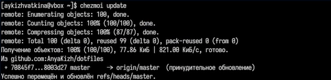

---
## Front matter
title: "Oтчёт по лабораторной работе 5"
subtitle: "Операционные системы"
author: "Кижваткина Анна Юрьевна"

## Generic otions
lang: ru-RU
toc-title: "Содержание"

## Bibliography
bibliography: bib/cite.bib
csl: pandoc/csl/gost-r-7-0-5-2008-numeric.csl

## Pdf output format
toc: true # Table of contents
toc-depth: 2
lof: true # List of figures
lot: true # List of tables
fontsize: 12pt
linestretch: 1.5
papersize: a4
documentclass: scrreprt
## I18n polyglossia
polyglossia-lang:
  name: russian
  options:
	- spelling=modern
	- babelshorthands=true
polyglossia-otherlangs:
  name: english
## I18n babel
babel-lang: russian
babel-otherlangs: english
## Fonts
mainfont: IBM Plex Serif
romanfont: IBM Plex Serif
sansfont: IBM Plex Sans
monofont: IBM Plex Mono
mathfont: STIX Two Math
mainfontoptions: Ligatures=Common,Ligatures=TeX,Scale=0.94
romanfontoptions: Ligatures=Common,Ligatures=TeX,Scale=0.94
sansfontoptions: Ligatures=Common,Ligatures=TeX,Scale=MatchLowercase,Scale=0.94
monofontoptions: Scale=MatchLowercase,Scale=0.94,FakeStretch=0.9
mathfontoptions:
## Biblatex
biblatex: true
biblio-style: "gost-numeric"
biblatexoptions:
  - parentracker=true
  - backend=biber
  - hyperref=auto
  - language=auto
  - autolang=other*
  - citestyle=gost-numeric
## Pandoc-crossref LaTeX customization
figureTitle: "Рис."
tableTitle: "Таблица"
listingTitle: "Листинг"
lofTitle: "Список иллюстраций"
lotTitle: "Список таблиц"
lolTitle: "Листинги"
## Misc options
indent: true
header-includes:
  - \usepackage{indentfirst}
  - \usepackage{float} # keep figures where there are in the text
  - \floatplacement{figure}{H} # keep figures where there are in the text
---

# Цель работы

Целью данной лабораторной работы является создание рабочего пространства для дальнейшего использования.

# Выполнение лабораторной работы

Установим pass. (рис. [-@fig:001])

{#fig:001 width=70%}

Установим gopass. (рис. [-@fig:002])

{#fig:002 width=70%}

Просмотрим список ключей. (рис. [-@fig:003])

{#fig:003 width=70%}

Инициализируем хранилище при помощи почты. (рис. [-@fig:004])

{#fig:004 width=70%}

Переходим к синхронизации с git. Создаем структуру git. (рис. [-@fig:005])

{#fig:005 width=70%}

Предварительно создав репозиторий, задаем адрес репозитория на хостинге. (рис. [-@fig:006])

{#fig:006 width=70%}

Выполняем синхронизацию двумя командами. (рис 2.7. и рис. 2.8.)(рис. [-@fig:007] рис. [-@fig:008])

{#fig:007 width=70%}

{#fig:008 width=70%}

Коммитим вручную. Переходим в нужный каталог. (рис. [-@fig:009])

{#fig:009 width=70%}

Выкладываем изменения. (рис. [-@fig:010])

{#fig:010 width=70%}

Проверяем статус синхронизации командой. (рис. [-@fig:011])

{#fig:011 width=70%}

Скачиваем плагин для firefox. (рис. [-@fig:012])

{#fig:012 width=70%}

Скачиваем интерфейс для взаимодействия с броузером. (рис. [-@fig:013] рис. [-@fig:014])

{#fig:013 width=70%}

{#fig:014 width=70%}

Создаем файл для пароля. (рис. [-@fig:015])

{#fig:015 width=70%}

Добавляем новый пароль. (рис. [-@fig:016])

{#fig:016 width=70%}

Отобразим пароль для указанного имени файла. (рис. [-@fig:017])

{#fig:017 width=70%}

Заменим существующий пароль новым. (рис. [-@fig:018])

{#fig:018 width=70%}

Установим дополнительное программное обеспечение. (рис. [-@fig:019])

{#fig:019 width=70%}

Установим шрифты. (рис. [-@fig:020] рис. [-@fig:021] рис. [-@fig:022])

{#fig:020 width=70%}

{#fig:021 width=70%}

{#fig:022 width=70%}

Устанавливаем бинарный файл. (рис. [-@fig:023])

{#fig:023 width=70%}

Создадим новый репозиторий для конфигурационных файлов на основе шаблона. (рис. [-@fig:024])

{#fig:024 width=70%}

Инициализируем chezmoi с нашим репозиторием dotfiles. (рис. [-@fig:025])

{#fig:025 width=70%}

Проверим какие изменения внесет chezmoi в домашний каталог. (рис. [-@fig:026])

{#fig:026 width=70%}

Проверяем устраивают ли нас изменения, дальше принимаем их. (рис. [-@fig:027])

{#fig:027 width=70%}

Открываем вторую виртуальную машину. Инициализируем на ней chezmoi с репозиторием dotfiles. (рис. [-@fig:028])

{#fig:028 width=70%}

Проверим какие изменения внесет chezmoi. (рис. [-@fig:029])

{#fig:029 width=70%}

Проверяем устраивают ли нас изменения, дальше принимаем их. (рис. [-@fig:030])

{#fig:030 width=70%}

Применяем изменения. (рис. [-@fig:031])

{#fig:031 width=70%}

Устанавливаем свои dotfiles на новую виртуальную машину одной командной. (рис. [-@fig:032])

{#fig:032 width=70%}

Можно извлечь изменения из репозитория и применить их одной командой. (рис. [-@fig:033])

{#fig:033 width=70%}

Извлечем последние изменения из нашего репозитория и посмотрим, что изменится, фактически не применяя изменения. (рис. [-@fig:034])

{#fig:034 width=70%}

Если мы довольны изменениями, применим их. (рис. [-@fig:035])

{#fig:035 width=70%}

Включаем автоматическое фиксирование и отправление изменений в исходный каталог в репозиторий. (рис. [-@fig:036])

{#fig:036 width=70%}

# Выводы

C помощью данной лабораторной работы я создала удобное рабочее пространство для дальнейшего использования.
