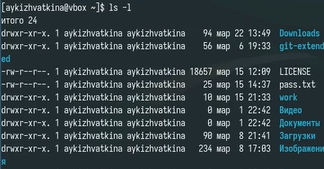

---
## Front matter
title: "Oтчёт по лабораторной работе 6"
subtitle: "Операционные системы"
author: "Кижваткина Анна Юрьевна"

## Generic otions
lang: ru-RU
toc-title: "Содержание"

## Bibliography
bibliography: bib/cite.bib
csl: pandoc/csl/gost-r-7-0-5-2008-numeric.csl

## Pdf output format
toc: true # Table of contents
toc-depth: 2
lof: true # List of figures
lot: true # List of tables
fontsize: 12pt
linestretch: 1.5
papersize: a4
documentclass: scrreprt
## I18n polyglossia
polyglossia-lang:
  name: russian
  options:
	- spelling=modern
	- babelshorthands=true
polyglossia-otherlangs:
  name: english
## I18n babel
babel-lang: russian
babel-otherlangs: english
## Fonts
mainfont: IBM Plex Serif
romanfont: IBM Plex Serif
sansfont: IBM Plex Sans
monofont: IBM Plex Mono
mathfont: STIX Two Math
mainfontoptions: Ligatures=Common,Ligatures=TeX,Scale=0.94
romanfontoptions: Ligatures=Common,Ligatures=TeX,Scale=0.94
sansfontoptions: Ligatures=Common,Ligatures=TeX,Scale=MatchLowercase,Scale=0.94
monofontoptions: Scale=MatchLowercase,Scale=0.94,FakeStretch=0.9
mathfontoptions:
## Biblatex
biblatex: true
biblio-style: "gost-numeric"
biblatexoptions:
  - parentracker=true
  - backend=biber
  - hyperref=auto
  - language=auto
  - autolang=other*
  - citestyle=gost-numeric
## Pandoc-crossref LaTeX customization
figureTitle: "Рис."
tableTitle: "Таблица"
listingTitle: "Листинг"
lofTitle: "Список иллюстраций"
lotTitle: "Список таблиц"
lolTitle: "Листинги"
## Misc options
indent: true
header-includes:
  - \usepackage{indentfirst}
  - \usepackage{float} # keep figures where there are in the text
  - \floatplacement{figure}{H} # keep figures where there are in the text
---

# Цель работы

Приобретение практических навыков взаимодействия пользователя с системой посредством командной строки.

# Выполнение лабораторной работы

Определяем полное имя нашего домашнего каталога. (рис. [-@fig:001]).

{#fig:001 width=70%}

Переходим в каталог /tmp. (рис. [-@fig:002]).

{#fig:002 width=70%}

Выводим на экран содержимое каталога /tmp с помощью разных аргументов. (рис. [-@fig:003] рис. [-@fig:004] рис. [-@fig:005]).

{#fig:003 width=70%}

{#fig:004 width=70%}

{#fig:005 width=70%}

Определяем есть ли в каталоге /var/spool подкаталог cron. (рис. [-@fig:006]).

{#fig:006 width=70%}

Переходим в домашний каталог и выводим на экран его содержимое. Владельцем содержимого являюсь я. (рис. [-@fig:007]).

{#fig:007 width=70%}

Создаем в каталоге подкаталог newdir. (рис. [-@fig:008]).

{#fig:008 width=70%}

Создаем в созданном каталоге каталог morefun. (рис. [-@fig:009]).

{#fig:009 width=70%}

В домашнем каталоге одной командой создаем 3 новых каталога. И удаляем их одной командой. (рис. [-@fig:010]).

{#fig:010 width=70%}

Пробуем удалить раннее созданный каталог newdir. (рис. [-@fig:011]).

{#fig:011 width=70%}

Удаляем каталог ~/newdir/morefun. (рис. [-@fig:012]).

{#fig:012 width=70%}

Используем команду man для того, чтобы определить какую опцию команды ls нужно использовать для просмотра каталогов и подкаталогов сразу. (рис. [-@fig:013]).

{#fig:013 width=70%}

Используем команду man для того, чтобы определить какую опцию команды ls нужно использовать для сортировки по времени последнего изменения выводимое на экран с развернутым описанием. (рис. [-@fig:014]).

{#fig:014 width=70%}

Используем команду man для просмотра описания следующих команд: cd, pwd, mkdir, rmdir, rm. Поясним основные из команд. (рис. [-@fig:015] рис. [-@fig:016] рис. [-@fig:017] рис. [-@fig:018] рис. [-@fig:019]).

{#fig:015 width=70%}
	1. -P — позволяет следовать по символическим ссылкам перед тем, как будут обработаны все переходы
	2. -L — переходит по символическим ссылкам только после того, как были обработаны

{#fig:016 width=70%}

	1. -L (логический) — выводит логический текущий рабочий каталог, включая символические ссылки. 
	2. -P (физический) — отображает физический текущий рабочий каталог, разрешая символические ссылки.

{#fig:017 width=70%}

	1. -p — позволяет создавать родительские каталоги по необходимости. Если каталоги уже существуют, ошибка не отображается. 
	2. -m — устанавливает режимы файлов (разрешения и т. д.) для созданных каталогов.

{#fig:018 width=70%}

	1. -p или --parents. Удаляет каталог и его родительские каталоги, если они пустые. 
	2. -v или --verbose. Выводит сообщение о каждом удалённом каталоге. 

{#fig:019 width=70%}

	1. -i (интерактивный) — запрашивает подтверждение каждого удаления. 
	2. -f (force) — игнорирует несуществующие файлы и переопределяет любые запросы на подтверждение.
	
Используя команду history, выполняем модификацию нескольких команд из буфера. (рис. [-@fig:020] рис. [-@fig:021]).

{#fig:020 width=70%}

{#fig:021 width=70%}

# Выводы

Мы приобрели практические навыки взаимодействия пользователя с системой посредством командной строки.
