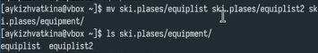

---
## Front matter
title: "Oтчёт по лабораторной работе 7"
subtitle: "Анализ файловой системы Linux. Команды для работы с файлами и каталогами"
author: "Кижваткина Анна Юрьевна"

## Generic otions
lang: ru-RU
toc-title: "Содержание"

## Bibliography
bibliography: bib/cite.bib
csl: pandoc/csl/gost-r-7-0-5-2008-numeric.csl

## Pdf output format
toc: true # Table of contents
toc-depth: 2
lof: true # List of figures
lot: true # List of tables
fontsize: 12pt
linestretch: 1.5
papersize: a4
documentclass: scrreprt
## I18n polyglossia
polyglossia-lang:
  name: russian
  options:
	- spelling=modern
	- babelshorthands=true
polyglossia-otherlangs:
  name: english
## I18n babel
babel-lang: russian
babel-otherlangs: english
## Fonts
mainfont: IBM Plex Serif
romanfont: IBM Plex Serif
sansfont: IBM Plex Sans
monofont: IBM Plex Mono
mathfont: STIX Two Math
mainfontoptions: Ligatures=Common,Ligatures=TeX,Scale=0.94
romanfontoptions: Ligatures=Common,Ligatures=TeX,Scale=0.94
sansfontoptions: Ligatures=Common,Ligatures=TeX,Scale=MatchLowercase,Scale=0.94
monofontoptions: Scale=MatchLowercase,Scale=0.94,FakeStretch=0.9
mathfontoptions:
## Biblatex
biblatex: true
biblio-style: "gost-numeric"
biblatexoptions:
  - parentracker=true
  - backend=biber
  - hyperref=auto
  - language=auto
  - autolang=other*
  - citestyle=gost-numeric
## Pandoc-crossref LaTeX customization
figureTitle: "Рис."
tableTitle: "Таблица"
listingTitle: "Листинг"
lofTitle: "Список иллюстраций"
lotTitle: "Список таблиц"
lolTitle: "Листинги"
## Misc options
indent: true
header-includes:
  - \usepackage{indentfirst}
  - \usepackage{float} # keep figures where there are in the text
  - \floatplacement{figure}{H} # keep figures where there are in the text
---

# Цель работы

Ознакомление с файловой системой Linux, её структурой, именами и содержанием каталогов. Приобретение практических навыков по применению команд для работы с файлами и каталогами, по управлению процессами (и работами), по проверке использования диска и обслуживанию файловой системы.

# Выполнение лабораторной работы

Описываются проведённые действия, в качестве иллюстрации даётся ссылка на иллюстрацию (рис. [-@fig:001]).

Выполняем все примеры, приведённые в первой части описания лабораторной работы.
Копируем файл в текущем каталоге. Нужно скопировать файл ~/abc1 в файл april и в файл may. (рис. [-@fig:001])

{#fig:001 width=70%}

Выполняем копирование нескольких файлов в каталог. Нужно скопировать файлы april и may в каталог monthly. (рис. [-@fig:002])

{#fig:002 width=70%}

Выполняем копирование файлов в произвольном каталоге. Нужно скопировать файл monthly/may в файл с именем june. (рис. [-@fig:003])

{#fig:003 width=70%}

Выполняем копирование каталогов в текущем каталоге. Нужно скопировать каталог monthly в каталог monthly.00. (рис. [-@fig:004])

{#fig:004 width=70%}

Выполнение копирование каталогов в произвольном каталоге. Нужно скопировать каталог monthly.00 в каталог /tmp. (рис. [-@fig:005])

{#fig:005 width=70%}

Выполняем переименовывание файлов в текущем каталоге. Нужно изменить название файла april на july в домашнем каталоге. (рис. [-@fig:006])

{#fig:006 width=70%}

Перемещение файлов в другой каталог. Перемещаем файл july в каталог monthly.00.  Проверяем. (рис. [-@fig:007])

{#fig:007 width=70%}

Выполняем переименовывание каталогов в текущем каталоге. Нужно переименовать каталог monthly.00 в monthly.01. (рис. [-@fig:008])

{#fig:008 width=70%}

Выполняем перемещение каталога в другой каталог. Нужно переместить каталог monthly.01в каталог reports. (рис. [-@fig:009])

{#fig:009 width=70%}

Выполняем переименование каталога, не являющегося текущим. Нужно переименовать каталог reports/monthly.01 в reports/monthly. (рис. [-@fig:010])

{#fig:010 width=70%}

Требуется создать файл ~/may с правом выполнения для владельца. (рис. [-@fig:011])

{#fig:011 width=70%}

Требуется лишить владельца файла ~/may права на выполнение. (рис. [-@fig:012])

{#fig:012 width=70%}

Требуется создать каталог monthly с запретом на чтение для членов группы и всех остальных пользователей. (рис. [-@fig:013])

{#fig:013 width=70%}

Требуется создать файл ~/abc1 с правом записи для членов группы. (рис. [-@fig:014])

{#fig:014 width=70%}

Переходим к выполнению заданий. Копируем файл /usr/include/sys/io.h в домашний каталог и называем его equipment. (рис. [-@fig:015])

{#fig:015 width=70%}

Создаем директорию ~/ski.plases. (рис. [-@fig:016])

{#fig:016 width=70%}

Перемещаем файл equipment в каталог ~/ski.plases. (рис. [-@fig:017])

{#fig:017 width=70%}

Переименовываем файл ~/ski.plases/equipment в ~/ski.plases/equiplist. (рис. [-@fig:018])

{#fig:018 width=70%}

Создаем в домашнем каталоге файл, копируем и переименовываем его в equiplist2. (рис. [-@fig:019])

{#fig:019 width=70%}

Создаем каталог с именем equipment в каталоге ~/ski.plases. (рис. [-@fig:020])

{#fig:020 width=70%}

Перемещаем файлы ~/ski.plases/equiplist и equiplist2 в каталог ~/ski.plases/equipment. (рис. [-@fig:021])

{#fig:021 width=70%}

Создаем и перемещаем каталог ~/newdir в каталог ~/ski.plases и назовите его plans. (рис. [-@fig:022])

{#fig:022 width=70%}

Создаем нужные файлы и каталоги. (рис. [-@fig:023])

{#fig:023 width=70%}

Выдаем созданным каталогам и файлам нужные права. (рис. [-@fig:024])

{#fig:024 width=70%}

Проверяем правильность выдачи прав. (рис. [-@fig:025] рис. [-@fig:026])

{#fig:025 width=70%}

{#fig:026 width=70%}

Просмотрим содержимое файла /etc/password. (рис. [-@fig:027])

{#fig:027 width=70%}

Скопируем файл ~/feathers в файл ~/file.old. (рис. [-@fig:028])

{#fig:028 width=70%}

Переместите файл ~/file.old в каталог ~/play.  (рис. [-@fig:029])

{#fig:029 width=70%}

Скопируйте каталог ~/play в каталог ~/fun. (рис. [-@fig:030])

{#fig:030 width=70%}

Переместите каталог ~/fun в каталог ~/play и назовите его games. (рис. [-@fig:031])

{#fig:031 width=70%}

Лишите владельца файла ~/feathers права на чтение. Больше нельзя скопировать или просмотреть файл. (рис. [-@fig:032])

{#fig:032 width=70%}

Дайте владельцу файла ~/feathers право на чтение. (рис. [-@fig:033])

{#fig:033 width=70%}

Лишите владельца каталога ~/play права на выполнение. Теперь нельз переместиться в файл. (рис. [-@fig:034])

{#fig:034 width=70%}

Дайте владельцу каталога ~/play право на выполнение. (рис. [-@fig:035])

{#fig:035 width=70%}

Прочитайте man по командам mount, fsck, mkfs, kill. (рис. [-@fig:036] рис. [-@fig:037] рис. [-@fig:038] рис. [-@fig:039])
 
{#fig:036 width=70%}

-V — вывести версию утилиты; -h — вывести справку; -v — подробный режим;

{#fig:037 width=70%}

 -A — проверка всех файловых систем в /etc/fstab; -C — показ прогресса выполнения проверки в системах ext2 и ext3; -V — вывод подробного описания выполняемой проверки;

{#fig:038 width=70%}

-с — проверить устройство на наличие битых секторов; -b — размер блока файловой системы; -j — использовать журналирование для ext3;

{#fig:039 width=70%}

# Выводы

Мы ознакомились с файловой системой Linux, её структурой, именами и содержанием каталогов. Приобрели практические навыки по применению команд для работы с файлами и каталогами, по управлению процессами (и работами), по проверке использования диска и обслуживанию файловой системы.
