---
## Front matter
title: "Oтчёт по лабораторной работе 8"
subtitle: "Поиск файлов. Перенаправление ввода-вывода. Просмотр запущенных процессов"
author: "Кижваткина Анна Юрьевна"

## Generic otions
lang: ru-RU
toc-title: "Содержание"

## Bibliography
bibliography: bib/cite.bib
csl: pandoc/csl/gost-r-7-0-5-2008-numeric.csl

## Pdf output format
toc: true # Table of contents
toc-depth: 2
lof: true # List of figures
lot: true # List of tables
fontsize: 12pt
linestretch: 1.5
papersize: a4
documentclass: scrreprt
## I18n polyglossia
polyglossia-lang:
  name: russian
  options:
	- spelling=modern
	- babelshorthands=true
polyglossia-otherlangs:
  name: english
## I18n babel
babel-lang: russian
babel-otherlangs: english
## Fonts
mainfont: IBM Plex Serif
romanfont: IBM Plex Serif
sansfont: IBM Plex Sans
monofont: IBM Plex Mono
mathfont: STIX Two Math
mainfontoptions: Ligatures=Common,Ligatures=TeX,Scale=0.94
romanfontoptions: Ligatures=Common,Ligatures=TeX,Scale=0.94
sansfontoptions: Ligatures=Common,Ligatures=TeX,Scale=MatchLowercase,Scale=0.94
monofontoptions: Scale=MatchLowercase,Scale=0.94,FakeStretch=0.9
mathfontoptions:
## Biblatex
biblatex: true
biblio-style: "gost-numeric"
biblatexoptions:
  - parentracker=true
  - backend=biber
  - hyperref=auto
  - language=auto
  - autolang=other*
  - citestyle=gost-numeric
## Pandoc-crossref LaTeX customization
figureTitle: "Рис."
tableTitle: "Таблица"
listingTitle: "Листинг"
lofTitle: "Список иллюстраций"
lotTitle: "Список таблиц"
lolTitle: "Листинги"
## Misc options
indent: true
header-includes:
  - \usepackage{indentfirst}
  - \usepackage{float} # keep figures where there are in the text
  - \floatplacement{figure}{H} # keep figures where there are in the text
---

# Цель работы

Ознакомление с инструментами поиска файлов и фильтрации текстовых данных. Приобретение практических навыков: по управлению процессами (и заданиями), по проверке использования диска и обслуживанию файловых систем.

# Выполнение лабораторной работы

Осуществляем вход в систему, используя соответствующее имя пользователя. Запишем в файл file.txt названия файлов, содержащихся в каталоге /etc. (рис. [-@fig:001])

{#fig:001 width=70%}

Дописываем в этот же файл названия файлов, содержащихся в нашем домашнем каталоге. (рис. [-@fig:002])

{#fig:002 width=70%}

Выводим имена всех файлов из file.txt, имеющих расширение .conf. (рис. [-@fig:003])

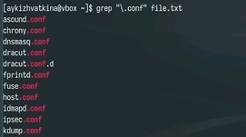{#fig:003 width=70%}

Записываем их имена в новый файл conf.txt. (рис. [-@fig:004])

{#fig:004 width=70%}

Определяем какие файлы в домашнем каталоге имеют имена, начинающиеся с символа с. (рис. [-@fig:005] рис. [-@fig:006])

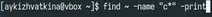{#fig:005 width=70%}
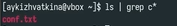{#fig:006 width=70%}

Выводим имена всех файлов из каталога /etc, начинающиеся с h. (рис. [-@fig:007])

{#fig:007 width=70%}

Запускаем в фоновом режиме процесс, который будет записывать в файл ~/logfile файлы, имена которых начинаются с log. (рис. [-@fig:008])

{#fig:008 width=70%}

Запускаем из консоли в фоновом режиме gedit. (рис. [-@fig:009])

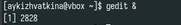{#fig:009 width=70%}

Определяем идентификатор процесса. (рис. [-@fig:010] рис. [-@fig:011] рис. [-@fig:012])

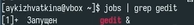{#fig:010 width=70%}
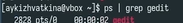{#fig:011 width=70%}
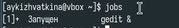{#fig:012 width=70%}

Читаем справку о kill. (рис. [-@fig:013])

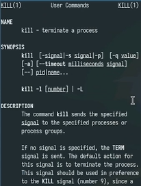{#fig:013 width=70%}

Завершаем gedit командой kill. (рис. [-@fig:014]) 

{#fig:014 width=70%}

Читаем справку о df и du. (рис. [-@fig:015] рис. [-@fig:016])

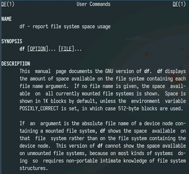{#fig:015 width=70%}
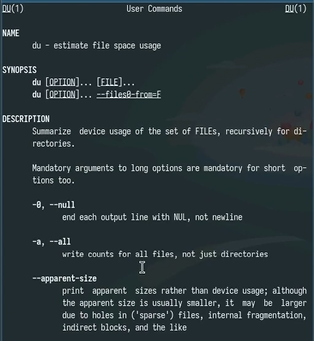{#fig:016 width=70%}

Запускаем df и du. (рис. [-@fig:017] рис. [-@fig:018])

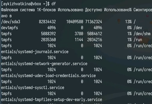{#fig:017 width=70%}
{#fig:018 width=70%}

Командой find выводим имена всех директорий из домашнего каталога. (рис. [-@fig:019])

{#fig:019 width=70%}

# Выводы

Мы ознакомились с инструментами поиска файлов и фильтрации текстовых данных. Приобрели практические навыки: по управлению процессами (и заданиями), по проверке использования диска и обслуживанию файловых систем.
