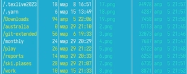

---
## Front matter
title: "Лабораторная работа №9"
subtitle: "Командная оболочка Midnight Commander"
author: "Кижваткина Анна Юрьевна"

## Generic otions
lang: ru-RU
toc-title: "Содержание"

## Bibliography
bibliography: bib/cite.bib
csl: pandoc/csl/gost-r-7-0-5-2008-numeric.csl

## Pdf output format
toc: true # Table of contents
toc-depth: 2
lof: true # List of figures
lot: true # List of tables
fontsize: 12pt
linestretch: 1.5
papersize: a4
documentclass: scrreprt
## I18n polyglossia
polyglossia-lang:
  name: russian
  options:
	- spelling=modern
	- babelshorthands=true
polyglossia-otherlangs:
  name: english
## I18n babel
babel-lang: russian
babel-otherlangs: english
## Fonts
mainfont: IBM Plex Serif
romanfont: IBM Plex Serif
sansfont: IBM Plex Sans
monofont: IBM Plex Mono
mathfont: STIX Two Math
mainfontoptions: Ligatures=Common,Ligatures=TeX,Scale=0.94
romanfontoptions: Ligatures=Common,Ligatures=TeX,Scale=0.94
sansfontoptions: Ligatures=Common,Ligatures=TeX,Scale=MatchLowercase,Scale=0.94
monofontoptions: Scale=MatchLowercase,Scale=0.94,FakeStretch=0.9
mathfontoptions:
## Biblatex
biblatex: true
biblio-style: "gost-numeric"
biblatexoptions:
  - parentracker=true
  - backend=biber
  - hyperref=auto
  - language=auto
  - autolang=other*
  - citestyle=gost-numeric
## Pandoc-crossref LaTeX customization
figureTitle: "Рис."
tableTitle: "Таблица"
listingTitle: "Листинг"
lofTitle: "Список иллюстраций"
lotTitle: "Список таблиц"
lolTitle: "Листинги"
## Misc options
indent: true
header-includes:
  - \usepackage{indentfirst}
  - \usepackage{float} # keep figures where there are in the text
  - \floatplacement{figure}{H} # keep figures where there are in the text
---

# Цель работы

Освоение основных возможностей командной оболочки Midnight Commander. Приобретение навыков практической работы по просмотру каталогов и файлов; манипуляций с ними.

# Выполнение лабораторной работы

Изучаем команду mc с помощью man. (рис. [-@fig:001])

{#fig:001 width=70%}

Запускаем из командной строки mc, изучаем его структуру и меню. (рис. [-@fig:002])

{#fig:002 width=70%}

Выполняем несколько операций в mc, используя управляющие клавиши (операции с панелями; выделение/отмена выделения файлов, копирование/перемещение файлов, получение информации о размере и правах доступа на файлы и/или каталоги и т.п.). (рис. [-@fig:003] рис. [-@fig:004] рис. [-@fig:005] рис. [-@fig:006])

{#fig:003 width=70%}

{#fig:004 width=70%}

{#fig:005 width=70%}

{#fig:006 width=70%}

Выполните основные команды меню левой (или правой) панели. Оцените степень подробности вывода информации о файлах. (рис. [-@fig:007] рис. [-@fig:008] рис. [-@fig:009] рис. [-@fig:010] рис. [-@fig:011])

{#fig:007 width=70%}

{#fig:008 width=70%}

{#fig:009 width=70%}

{#fig:010 width=70%}

{#fig:011 width=70%}

Используя возможности подменю Файл, выполняем: 
	– просмотр содержимого текстового файла; 
	– редактирование содержимого текстового файла (без сохранения результатов редактирования);
	– создание каталога;
	– копирование файлов в созданный каталог. (рис. [-@fig:012] рис. [-@fig:013] рис. [-@fig:014] рис. [-@fig:015])
 
{#fig:012 width=70%}

{#fig:013 width=70%}

{#fig:014 width=70%}

{#fig:015 width=70%}

С помощью соответствующих средств подменю Команда осуществите: 
	– поиск в файловой системе файла с заданными условиями (например, файла с расширением .c или .cpp, содержащего строку main); 
	– выбор и повторение одной из предыдущих команд;
	– переход в домашний каталог; 
	– анализ файла меню и файла расширений. (рис. [-@fig:016] рис. [-@fig:017] рис. [-@fig:018] рис. [-@fig:019])
	
{#fig:016 width=70%}

{#fig:017 width=70%}

{#fig:018 width=70%}

{#fig:019 width=70%}

Вызовите подменю Настройки. Освойте операции, определяющие структуру экрана mc (Full screen, Double Width, Show Hidden Files и т.д.). (рис. [-@fig:020])

{#fig:020 width=70%}

Создайте текстовой файл text.txt. (рис. [-@fig:021])

{#fig:021 width=70%}

Откройте этот файл с помощью встроенного в mc редактора. (рис. [-@fig:022])

{#fig:022 width=70%}

Вставьте в открытый файл небольшой фрагмент текста, скопированный из любого другого файла или Интернета. (рис. [-@fig:023])

{#fig:023 width=70%}

Проделайте с текстом следующие манипуляции, используя горячие клавиши: 

Удалите строку текста. (рис. [-@fig:024])

{#fig:024 width=70%}

Выделите фрагмент текста и скопируйте его на новую строку. (рис. [-@fig:025])

{#fig:025 width=70%}

Выделите фрагмент текста и перенесите его на новую строку. (рис. [-@fig:026])

{#fig:026 width=70%}

Сохраните файл. (рис. [-@fig:027])

{#fig:027 width=70%}

Отмените последнее действие. (рис. [-@fig:028])

{#fig:028 width=70%}

Перейдите в конец файла (нажав комбинацию клавиш) и напишите некоторый текст. (рис. [-@fig:029])

{#fig:029 width=70%}

Перейдите в начало файла (нажав комбинацию клавиш) и напишите некоторый текст. (рис. [-@fig:030])

{#fig:030 width=70%}

Сохраните и закройте файл. (рис. [-@fig:031])

{#fig:031 width=70%}

Откройте файл с исходным текстом на некотором языке программирования (например C или Java). (рис. [-@fig:032])

{#fig:032 width=70%}

Используя меню редактора, включите подсветку синтаксиса, если она не включена, или выключите, если она включена. (рис. [-@fig:033])

{#fig:033 width=70%}

# Выводы

Мы освоили основные возможности командной оболочки Midnight Commander. Приобрели навыки практической работы по просмотру каталогов и файлов; манипуляций с ними.
