---
## Front matter
title: "Лабораторная работа №10"
subtitle: "Текстовой редактор vi."
author: "Кижваткина Анна Юрьевна"

## Generic otions
lang: ru-RU
toc-title: "Содержание"

## Bibliography
bibliography: bib/cite.bib
csl: pandoc/csl/gost-r-7-0-5-2008-numeric.csl

## Pdf output format
toc: true # Table of contents
toc-depth: 2
lof: true # List of figures
lot: true # List of tables
fontsize: 12pt
linestretch: 1.5
papersize: a4
documentclass: scrreprt
## I18n polyglossia
polyglossia-lang:
  name: russian
  options:
	- spelling=modern
	- babelshorthands=true
polyglossia-otherlangs:
  name: english
## I18n babel
babel-lang: russian
babel-otherlangs: english
## Fonts
mainfont: IBM Plex Serif
romanfont: IBM Plex Serif
sansfont: IBM Plex Sans
monofont: IBM Plex Mono
mathfont: STIX Two Math
mainfontoptions: Ligatures=Common,Ligatures=TeX,Scale=0.94
romanfontoptions: Ligatures=Common,Ligatures=TeX,Scale=0.94
sansfontoptions: Ligatures=Common,Ligatures=TeX,Scale=MatchLowercase,Scale=0.94
monofontoptions: Scale=MatchLowercase,Scale=0.94,FakeStretch=0.9
mathfontoptions:
## Biblatex
biblatex: true
biblio-style: "gost-numeric"
biblatexoptions:
  - parentracker=true
  - backend=biber
  - hyperref=auto
  - language=auto
  - autolang=other*
  - citestyle=gost-numeric
## Pandoc-crossref LaTeX customization
figureTitle: "Рис."
tableTitle: "Таблица"
listingTitle: "Листинг"
lofTitle: "Список иллюстраций"
lotTitle: "Список таблиц"
lolTitle: "Листинги"
## Misc options
indent: true
header-includes:
  - \usepackage{indentfirst}
  - \usepackage{float} # keep figures where there are in the text
  - \floatplacement{figure}{H} # keep figures where there are in the text
---

# Цель работы

Целью данной лабораторной работы является ознакомление с операционной системой Linux. Получение практических навыков работы с редактором vi, установленным по умолчанию практически во всех дистрибутивах.

# Выполнение лабораторной работы

Создайте каталог с именем ~/work/os/lab10. (рис. [-@fig:001])

{#fig:001 width=70%}

Перейдите во вновь созданный каталог. (рис. [-@fig:002])

{#fig:002 width=70%}

Вызовите vi и создайте файл hello.sh. (рис. [-@fig:003])

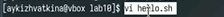{#fig:003 width=70%}

Нажмите клавишу i и вводите следующий текст. (рис. [-@fig:004])
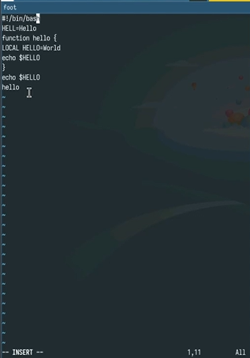{#fig:004 width=70%}

Нажмите клавишу Esc для перехода в командный режим после завершения ввода текста. (рис. [-@fig:005])

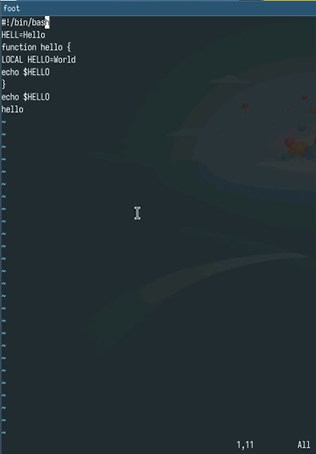{#fig:005 width=70%}

Нажмите : для перехода в режим последней строки и внизу вашего экрана появится приглашение в виде двоеточия. (рис. [-@fig:006])

{#fig:006 width=70%}

Нажмите w (записать) и q (выйти), а затем нажмите клавишу Enter для сохранения вашего текста и завершения работы. (рис. [-@fig:007])

{#fig:007 width=70%}

Сделайте файл исполняемым. (рис. [-@fig:008])

{#fig:008 width=70%}

Вызовите vi на редактирование файла. (рис. [-@fig:009])

{#fig:009 width=70%}

Установите курсор в конец слова HELL второй строки. (рис. [-@fig:010])

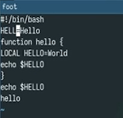{#fig:010 width=70%}

Перейдите в режим вставки и замените на HELLO. Нажмите Esc для возврата в командный режим. (рис. [-@fig:011])

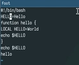{#fig:011 width=70%}

Установите курсор на четвертую строку и сотрите слово LOCAL. (рис. [-@fig:012])

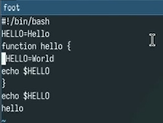{#fig:012 width=70%}

Перейдите в режим вставки и наберите следующий текст: local, нажмите Esc для возврата в командный режим. (рис. [-@fig:013])

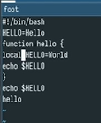{#fig:013 width=70%}

Установите курсор на последней строке файла. Вставьте после неё строку, содержащую следующий текст: echo $HELLO. (рис. [-@fig:014])

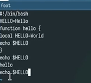{#fig:014 width=70%}

Нажмите Esc для перехода в командный режим. (рис. [-@fig:015])

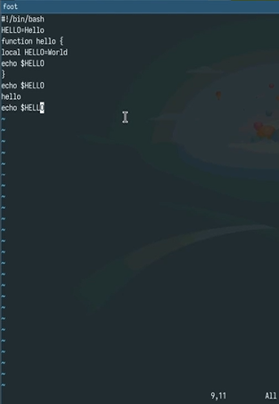{#fig:015 width=70%}

Удалите последнюю строку. (рис. [-@fig:016])

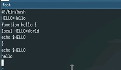{#fig:016 width=70%}

Введите команду отмены изменений u для отмены последней команды. (рис. [-@fig:017]) 

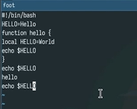{#fig:017 width=70%}

Введите символ: для перехода в режим последней строки. Запишите произведённые изменения и выйдите из vi. (рис. [-@fig:018])

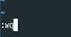{#fig:018 width=70%}

# Выводы

В ходе лабораторной работы мы ознакомились с операционной системой Linux. Получили практические навыки работы с редактором vi, установленным по умолчанию практически во всех дистрибутивах.
