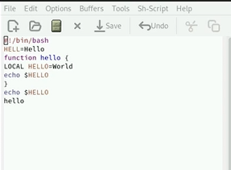
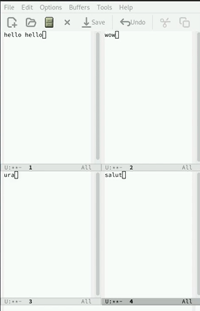

---
## Front matter
title: "Лабораторная работа №11"
subtitle: "Текстовой редактор emacs"
author: "Кижваткина Анна Юрьевна"

## Generic otions
lang: ru-RU
toc-title: "Содержание"

## Bibliography
bibliography: bib/cite.bib
csl: pandoc/csl/gost-r-7-0-5-2008-numeric.csl

## Pdf output format
toc: true # Table of contents
toc-depth: 2
lof: true # List of figures
lot: true # List of tables
fontsize: 12pt
linestretch: 1.5
papersize: a4
documentclass: scrreprt
## I18n polyglossia
polyglossia-lang:
  name: russian
  options:
	- spelling=modern
	- babelshorthands=true
polyglossia-otherlangs:
  name: english
## I18n babel
babel-lang: russian
babel-otherlangs: english
## Fonts
mainfont: IBM Plex Serif
romanfont: IBM Plex Serif
sansfont: IBM Plex Sans
monofont: IBM Plex Mono
mathfont: STIX Two Math
mainfontoptions: Ligatures=Common,Ligatures=TeX,Scale=0.94
romanfontoptions: Ligatures=Common,Ligatures=TeX,Scale=0.94
sansfontoptions: Ligatures=Common,Ligatures=TeX,Scale=MatchLowercase,Scale=0.94
monofontoptions: Scale=MatchLowercase,Scale=0.94,FakeStretch=0.9
mathfontoptions:
## Biblatex
biblatex: true
biblio-style: "gost-numeric"
biblatexoptions:
  - parentracker=true
  - backend=biber
  - hyperref=auto
  - language=auto
  - autolang=other*
  - citestyle=gost-numeric
## Pandoc-crossref LaTeX customization
figureTitle: "Рис."
tableTitle: "Таблица"
listingTitle: "Листинг"
lofTitle: "Список иллюстраций"
lotTitle: "Список таблиц"
lolTitle: "Листинги"
## Misc options
indent: true
header-includes:
  - \usepackage{indentfirst}
  - \usepackage{float} # keep figures where there are in the text
  - \floatplacement{figure}{H} # keep figures where there are in the text
---

# Цель работы

Познакомиться с операционной системой Linux. Получить практические навыки работы с редактором Emacs.

# Выполнение лабораторной работы

Открываем emacs. (рис. [-@fig:001])

{#fig:001 width=70%}

Создаем файл lab07.sh с помощью комбинации Ctrl-x Ctrl-f. (рис. [-@fig:002])

{#fig:002 width=70%}

Набираем текст. (рис. [-@fig:003])

{#fig:003 width=70%}

Сохраняем файл с помощью комбинации Ctrl-x Ctrl-s. (рис. [-@fig:004])

{#fig:004 width=70%}

Проделываем с текстом стандартные процедуры редактирования, каждое действие осуществляем комбинацией клавиш. (рис. [-@fig:005])

{#fig:005 width=70%}

Вырезаем одной командой целую строку (С-k). (рис. [-@fig:006])

{#fig:006 width=70%}

Вставляем эту строку в конец файла (C-y). (рис. [-@fig:007])

{#fig:007 width=70%}

Выделяем область текста (C-space). (рис. [-@fig:008])

{#fig:008 width=70%}

Копируем область в буфер обмена (M-w). (рис. [-@fig:009])

{#fig:009 width=70%}

Вставляем область в конец файла. (рис. [-@fig:010])
{#fig:010 width=70%}

Вновь выделяем эту область и на этот раз вырезать её (C-w). (рис. [-@fig:011])

{#fig:011 width=70%}

Отменяем последнее действие (C-/). (рис. [-@fig:012])

{#fig:012 width=70%}

Научимся использовать команды по перемещению курсора. Переместим курсор в начало строки (C-a). (рис. [-@fig:013])

{#fig:013 width=70%}

Переместим курсор в конец строки (C-e). (рис. [-@fig:014])

{#fig:014 width=70%}

Переместим курсор в начало буфера (M-<). (рис. [-@fig:015])

{#fig:015 width=70%}

Переместим курсор в конец буфера (M->). (рис. [-@fig:016])

{#fig:016 width=70%}

Выведем список активных буферов на экран (C-x C-b). (рис. [-@fig:017])

{#fig:017 width=70%}

Переместимся во вновь открытое окно (C-x) o со списком открытых буферов и переключимся на другой буфер. (рис. [-@fig:018])

{#fig:018 width=70%}

Закроем это окно (C-x 0). (рис. [-@fig:019])

{#fig:019 width=70%}

Теперь вновь переключимся между буферами, но уже без вывода их списка на экран (C-x b). (рис. [-@fig:020])

{#fig:020 width=70%}

Поделим фрейм на 4 части: разделим фрейм на два окна по вертикали (C-x 3), а затем каждое из этих окон на две части по горизонтали (C-x 2). (рис. [-@fig:021])

{#fig:021 width=70%}

В каждом из четырёх созданных окон откроем новый буфер (файл) и введем несколько строк текста. (рис. [-@fig:022])

{#fig:022 width=70%}

Переключимся в режим поиска (C-s) и найдем несколько слов, присутствующих в тексте. (рис. [-@fig:023])

{#fig:023 width=70%}

Переключимся между результатами поиска, нажимая C-s. (рис. [-@fig:024])

{#fig:024 width=70%}

Перейдем в режим поиска и замены (M-%), введем текст, который следует найти и заменить, нажмем Enter. (рис. [-@fig:025])

{#fig:025 width=70%}

Затем введем текст для замены. (рис. [-@fig:026])

{#fig:026 width=70%}

После того как будут подсвечены результаты поиска. (рис. [-@fig:027])

{#fig:027 width=70%}

Нажмем ! для подтверждения замены. (рис. [-@fig:028])

{#fig:028 width=70%}

Испробуем другой режим поиска, нажав M-s o. (рис. [-@fig:029])

{#fig:029 width=70%}

# Выводы

В ходе данной лабораторной работы я ознакомилась с операционной системой Linux. Получила практические навыки работы с редактором Emacs.
