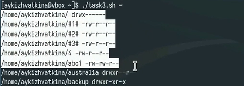

---
## Front matter
title: "Лабораторная работа №12"
subtitle: "Программирование в командном процессоре ОС UNIX. Командные файлы"
author: "Кижваткина Анна Юрьевна"

## Generic otions
lang: ru-RU
toc-title: "Содержание"

## Bibliography
bibliography: bib/cite.bib
csl: pandoc/csl/gost-r-7-0-5-2008-numeric.csl

## Pdf output format
toc: true # Table of contents
toc-depth: 2
lof: true # List of figures
lot: true # List of tables
fontsize: 12pt
linestretch: 1.5
papersize: a4
documentclass: scrreprt
## I18n polyglossia
polyglossia-lang:
  name: russian
  options:
	- spelling=modern
	- babelshorthands=true
polyglossia-otherlangs:
  name: english
## I18n babel
babel-lang: russian
babel-otherlangs: english
## Fonts
mainfont: IBM Plex Serif
romanfont: IBM Plex Serif
sansfont: IBM Plex Sans
monofont: IBM Plex Mono
mathfont: STIX Two Math
mainfontoptions: Ligatures=Common,Ligatures=TeX,Scale=0.94
romanfontoptions: Ligatures=Common,Ligatures=TeX,Scale=0.94
sansfontoptions: Ligatures=Common,Ligatures=TeX,Scale=MatchLowercase,Scale=0.94
monofontoptions: Scale=MatchLowercase,Scale=0.94,FakeStretch=0.9
mathfontoptions:
## Biblatex
biblatex: true
biblio-style: "gost-numeric"
biblatexoptions:
  - parentracker=true
  - backend=biber
  - hyperref=auto
  - language=auto
  - autolang=other*
  - citestyle=gost-numeric
## Pandoc-crossref LaTeX customization
figureTitle: "Рис."
tableTitle: "Таблица"
listingTitle: "Листинг"
lofTitle: "Список иллюстраций"
lotTitle: "Список таблиц"
lolTitle: "Листинги"
## Misc options
indent: true
header-includes:
  - \usepackage{indentfirst}
  - \usepackage{float} # keep figures where there are in the text
  - \floatplacement{figure}{H} # keep figures where there are in the text
---

# Цель работы

Изучить основы программирования в оболочке ОС UNIX/Linux. Научиться писать небольшие командные файлы.

# Выполнение лабораторной работы

Создаем директорию backup. (рис. [-@fig:001])

{#fig:001 width=70%}

Создаем файл task1.sh. (рис. [-@fig:002])

{#fig:002 width=70%}

Пишем скрипт, который при запуске будет делать резервную копию самого себя (то есть файла, в котором содержится его исходный код) в другую директорию backup в вашем домашнем каталоге. При этом файл должен архивироваться одним из архиваторов на выбор zip, bzip2 или tar. Способ использования команд архивации необходимо узнать, изучив справку.  (рис. [-@fig:003])

{#fig:003 width=70%}

Предоставляем полный доступ (чтение, запись и выполнение) к файлу или каталогу для всех пользователей. (рис. [-@fig:004])

{#fig:004 width=70%}

Проверяем выполнение программы. (рис. [-@fig:005])

{#fig:005 width=70%}

Создаем файл task2.sh. (рис. [-@fig:006])

{#fig:006 width=70%}

Предоставляем полный доступ (чтение, запись и выполнение) к файлу или каталогу для всех пользователей. (рис. [-@fig:007])

{#fig:007 width=70%}

Пишем пример командного файла, обрабатывающего любое произвольное число аргументов командной строки, в том числе превышающее десять. Например, скрипт может последовательно распечатывать значения всех переданных аргументов. (рис. [-@fig:008])

{#fig:008 width=70%}

Проверяем выполнение программы. (рис. [-@fig:009])

{#fig:009 width=70%}

Создаем файл task3.sh. (рис. [-@fig:010])

{#fig:010 width=70%}

Предоставляем полный доступ (чтение, запись и выполнение) к файлу или каталогу для всех пользователей. (рис. [-@fig:011])

{#fig:011 width=70%}

Пишем командный файл — аналог команды ls (без использования самой этой команды и команды dir). Требуется, чтобы он выдавал информацию о нужном каталоге и выводил информацию о возможностях доступа к файлам этого каталога. (рис. [-@fig:012])

{#fig:012 width=70%}

Проверяем выполнение программы. (рис. [-@fig:013])

{#fig:013 width=70%}

Создаем файл task4.sh. (рис. [-@fig:014])

{#fig:014 width=70%}

Предоставляем полный доступ (чтение, запись и выполнение) к файлу или каталогу для всех пользователей. (рис. [-@fig:015])

{#fig:015 width=70%}

Пишем командный файл, который получает в качестве аргумента командной строки формат файла (.txt, .doc, .jpg, .pdf и т.д.) и вычисляет количество таких файлов в указанной директории. Путь к директории также передаётся в виде аргумента командной строки. (рис. [-@fig:016])

{#fig:016 width=70%}

Проверяем выполнение программы. (рис. [-@fig:017])

{#fig:017 width=70%}

# Выводы

В ходе данной лабораторной работы мы изучили основы программирования в оболочке ОС UNIX/Linux. Научились писать небольшие командные файлы.
