---
## Front matter
title: "Лабораторная работа №13"
subtitle: "Программирование в командном процессоре ОС UNIX. Ветвления и циклы"
author: "Кижваткина Анна Юрьевна"

## Generic otions
lang: ru-RU
toc-title: "Содержание"

## Bibliography
bibliography: bib/cite.bib
csl: pandoc/csl/gost-r-7-0-5-2008-numeric.csl

## Pdf output format
toc: true # Table of contents
toc-depth: 2
lof: true # List of figures
lot: true # List of tables
fontsize: 12pt
linestretch: 1.5
papersize: a4
documentclass: scrreprt
## I18n polyglossia
polyglossia-lang:
  name: russian
  options:
	- spelling=modern
	- babelshorthands=true
polyglossia-otherlangs:
  name: english
## I18n babel
babel-lang: russian
babel-otherlangs: english
## Fonts
mainfont: IBM Plex Serif
romanfont: IBM Plex Serif
sansfont: IBM Plex Sans
monofont: IBM Plex Mono
mathfont: STIX Two Math
mainfontoptions: Ligatures=Common,Ligatures=TeX,Scale=0.94
romanfontoptions: Ligatures=Common,Ligatures=TeX,Scale=0.94
sansfontoptions: Ligatures=Common,Ligatures=TeX,Scale=MatchLowercase,Scale=0.94
monofontoptions: Scale=MatchLowercase,Scale=0.94,FakeStretch=0.9
mathfontoptions:
## Biblatex
biblatex: true
biblio-style: "gost-numeric"
biblatexoptions:
  - parentracker=true
  - backend=biber
  - hyperref=auto
  - language=auto
  - autolang=other*
  - citestyle=gost-numeric
## Pandoc-crossref LaTeX customization
figureTitle: "Рис."
tableTitle: "Таблица"
listingTitle: "Листинг"
lofTitle: "Список иллюстраций"
lotTitle: "Список таблиц"
lolTitle: "Листинги"
## Misc options
indent: true
header-includes:
  - \usepackage{indentfirst}
  - \usepackage{float} # keep figures where there are in the text
  - \floatplacement{figure}{H} # keep figures where there are in the text
---

# Цель работы

Изучить основы программирования в оболочке ОС UNIX. Научится писать более сложные командные файлы с использованием логических управляющих конструкций и циклов.

# Выполнение лабораторной работы

Создаем директорию lab13 и перемещаемся в неё. (рис. [-@fig:001])

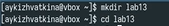{#fig:001 width=70%}

Создаем файл 1.sh и text. (рис. [-@fig:002])

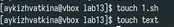{#fig:002 width=70%}

Используя команды getopts grep, написать командный файл, который анализирует командную строку с ключами: 

	– -iinputfile — прочитать данные из указанного файла; 
	– -ooutputfile — вывести данные в указанный файл; 
	– -pшаблон — указать шаблон для поиска; 
	– -C — различать большие и малые буквы; 
	– -n — выдавать номера строк. 
	
а затем ищет в указанном файле нужные строки, определяемые ключом -p. (рис. [-@fig:003])

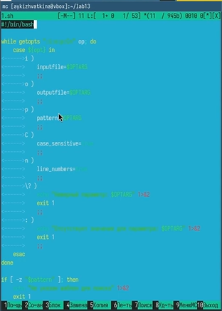{#fig:003 width=70%}

Устанавливаем право на выполнение. (рис. [-@fig:004])

{#fig:004 width=70%}

Проверяем выполнение программы. (рис. [-@fig:005])

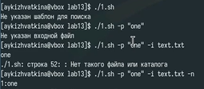{#fig:005 width=70%}

Создаем файл 2.sh и 2.с и устанавливаем право на выполнение. (рис. [-@fig:006])

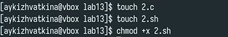{#fig:006 width=70%}

Написать на языке Си программу, которая вводит число и определяет, является ли оно больше нуля, меньше нуля или равно нулю. Затем программа завершается с помощью функции exit(n), передавая информацию в о коде завершения в оболочку. Командный файл должен вызывать эту программу и, проанализировав с помощью команды $?, выдать сообщение о том, какое число было введено. (рис. [-@fig:007] и рис. [-@fig:008])

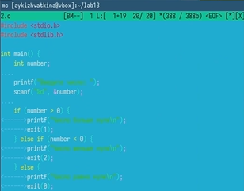{#fig:007 width=70%}

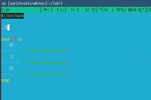{#fig:008 width=70%}

Проверяем выполнение программы. (рис. [-@fig:009])

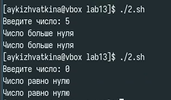{#fig:009 width=70%}

Создаем файл 3.sh. (рис. [-@fig:010])

{#fig:010 width=70%}

Устанавливаем право на выполнение. (рис. [-@fig:011])

{#fig:011 width=70%}

Написать командный файл, создающий указанное число файлов, пронумерованных последовательно от 1 до 𝑁 (например 1.tmp, 2.tmp, 3.tmp, 4.tmp и т.д.). Число файлов, которые необходимо создать, передаётся в аргументы командной строки. Этот же командный файл должен уметь удалять все созданные им файлы (если они существуют). (рис. [-@fig:012])

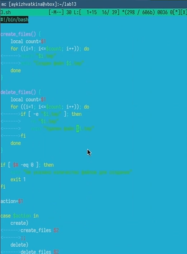{#fig:012 width=70%}

Проверяем выполнение программы. (рис. [-@fig:013])

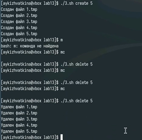{#fig:013 width=70%}

Создаем файл 4.sh. (рис. [-@fig:014])

{#fig:014 width=70%}

Устанавливаем право на выполнение. (рис. [-@fig:015])

{#fig:015 width=70%}

Написать командный файл, который с помощью команды tar запаковывает в архив все файлы в указанной директории. Модифицировать его так, чтобы запаковывались только те файлы, которые были изменены менее недели тому назад (использовать команду find). (рис. [-@fig:016])

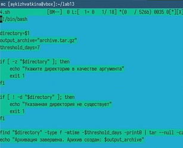{#fig:016 width=70%}

Проверяем выполнение программы. (рис. [-@fig:017] и рис. [-@fig:018])

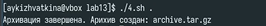{#fig:017 width=70%}

{#fig:018 width=70%}

# Выводы

С помощью данной лабораторной работы мы изучили основы программирования в оболочке ОС UNIX. Научились писать более сложные командные файлы с использованием логических управляющих конструкций и циклов.
