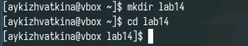
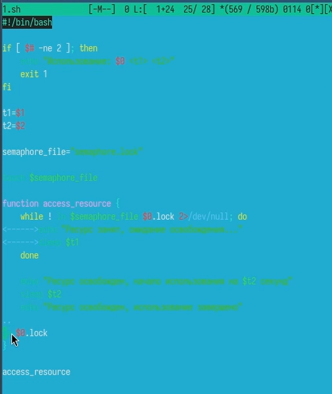
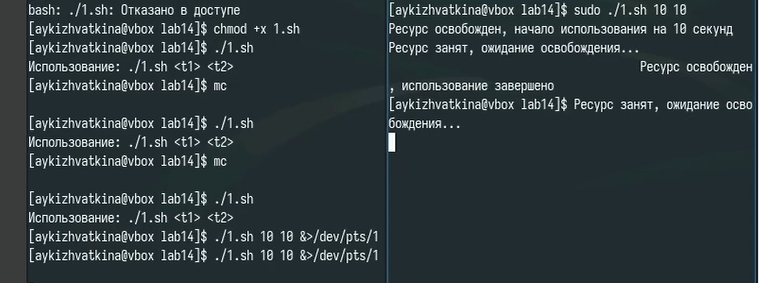
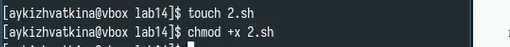
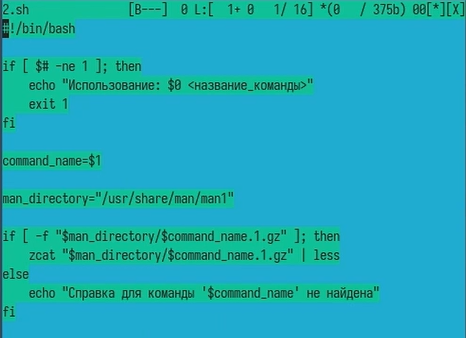
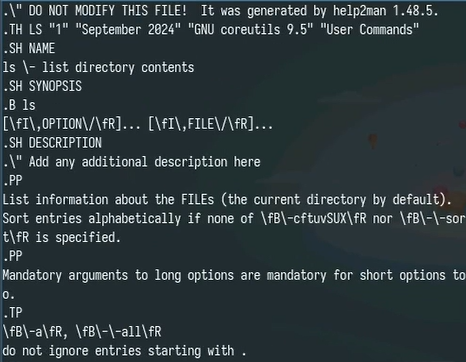
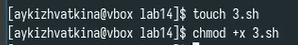
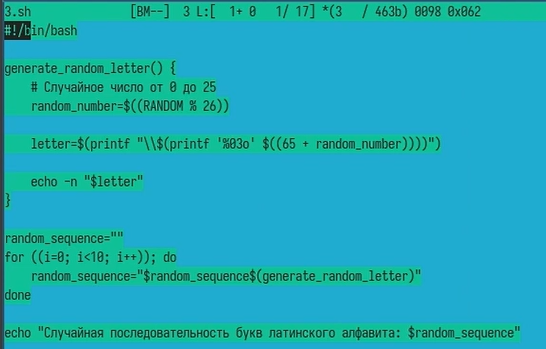
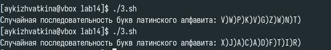

---
## Front matter
title: "Лабораторная работа №14"
subtitle: "Программирование в командном процессоре ОС UNIX. Расширенное программирование"
author: "Кижваткина Анна Юрьевна"

## Generic otions
lang: ru-RU
toc-title: "Содержание"

## Bibliography
bibliography: bib/cite.bib
csl: pandoc/csl/gost-r-7-0-5-2008-numeric.csl

## Pdf output format
toc: true # Table of contents
toc-depth: 2
lof: true # List of figures
lot: true # List of tables
fontsize: 12pt
linestretch: 1.5
papersize: a4
documentclass: scrreprt
## I18n polyglossia
polyglossia-lang:
  name: russian
  options:
	- spelling=modern
	- babelshorthands=true
polyglossia-otherlangs:
  name: english
## I18n babel
babel-lang: russian
babel-otherlangs: english
## Fonts
mainfont: IBM Plex Serif
romanfont: IBM Plex Serif
sansfont: IBM Plex Sans
monofont: IBM Plex Mono
mathfont: STIX Two Math
mainfontoptions: Ligatures=Common,Ligatures=TeX,Scale=0.94
romanfontoptions: Ligatures=Common,Ligatures=TeX,Scale=0.94
sansfontoptions: Ligatures=Common,Ligatures=TeX,Scale=MatchLowercase,Scale=0.94
monofontoptions: Scale=MatchLowercase,Scale=0.94,FakeStretch=0.9
mathfontoptions:
## Biblatex
biblatex: true
biblio-style: "gost-numeric"
biblatexoptions:
  - parentracker=true
  - backend=biber
  - hyperref=auto
  - language=auto
  - autolang=other*
  - citestyle=gost-numeric
## Pandoc-crossref LaTeX customization
figureTitle: "Рис."
tableTitle: "Таблица"
listingTitle: "Листинг"
lofTitle: "Список иллюстраций"
lotTitle: "Список таблиц"
lolTitle: "Листинги"
## Misc options
indent: true
header-includes:
  - \usepackage{indentfirst}
  - \usepackage{float} # keep figures where there are in the text
  - \floatplacement{figure}{H} # keep figures where there are in the text
---

# Цель работы

Изучить основы программирования в оболочке ОС UNIX. Научиться писать более сложные командные файлы с использованием логических управляющих конструкций и циклов.

# Выполнение лабораторной работы

Создаем директорию lab14 и перемещаемся в неё. (рис. [-@fig:001])

{#fig:001 width=70%}

Создаем файл 1.sh. (рис. [-@fig:002])

{#fig:002 width=70%}

Пишем командный файл, реализующий упрощённый механизм семафоров. Командный файл должен в течение некоторого времени t1 дожидаться освобождения ресурса, выдавая об этом сообщение, а дождавшись его освобождения, использовать его в течение некоторого времени t2<>t1, также выдавая информацию о том, что ресурс используется соответствующим командным файлом (процессом). Запустить командный файл в одном виртуальном терминале в фоновом режиме, перенаправив его вывод в другой (> /dev/tty#, где # — номер терминала куда перенаправляется вывод), в котором также запущен этот файл, но не фоновом, а в привилегированном режиме. Доработать программу так, чтобы имелась возможность взаимодействия трёх и более процессов. . (рис. [-@fig:003])

{#fig:003 width=70%}

Устанавливаем право на выполнение. (рис. [-@fig:004])

{#fig:004 width=70%}

Проверяем выполнение программы. (рис. [-@fig:005])

{#fig:005 width=70%}

Создаем файл 2.sh и устанавливаем право на выполнение. (рис. [-@fig:006])

{#fig:006 width=70%}

Реализовываем команду man с помощью командного файла. Изучите содержимое каталога /usr/share/man/man1. В нем находятся архивы текстовых файлов, содержащих справку по большинству установленных в системе программ и команд. Каждый архив можно открыть командой less сразу же просмотрев содержимое справки. Командный файл должен получать в виде аргумента командной строки название команды и в виде результата выдавать справку об этой команде или сообщение об отсутствии справки, если соответствующего файла нет в каталоге man1. (рис. [-@fig:007] и рис. [-@fig:008])

{#fig:007 width=70%}

Проверяем выполнение программы. (рис. [-@fig:008])

{#fig:008 width=70%}

Создаем файл 3.sh и устанавливаем право на выполнение. (рис. [-@fig:009])

{#fig:009 width=70%}

Используя встроенную переменную $RANDOM, пишем командный файл, генерирующий случайную последовательность букв латинского алфавита. Учтите, что $RANDOM выдаёт псевдослучайные числа в диапазоне от 0 до 32767. (рис. [-@fig:010])

{#fig:010 width=70%}

Проверяем выполнение программы. (рис. [-@fig:011])

{#fig:011width=70%}

# Выводы

Я изучила основы программирования в оболочке ОС UNIX. Научилась писать более сложные командные файлы с использованием логических управляющих конструкций и циклов.
